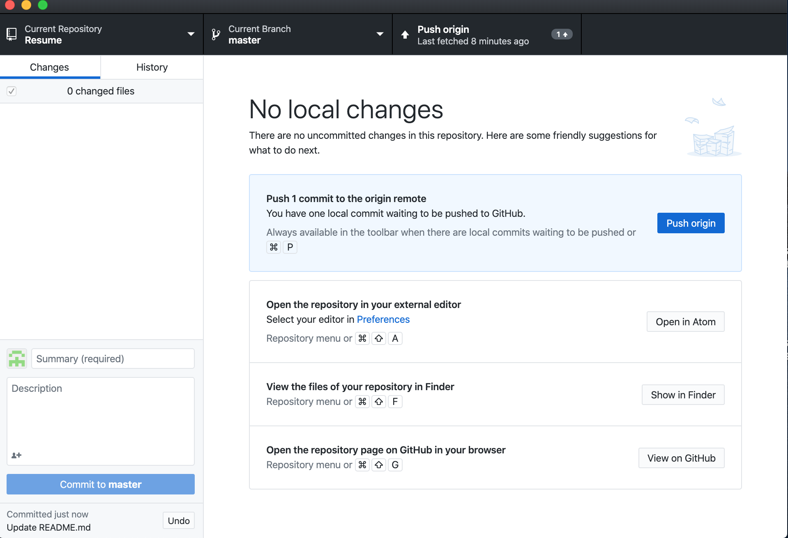
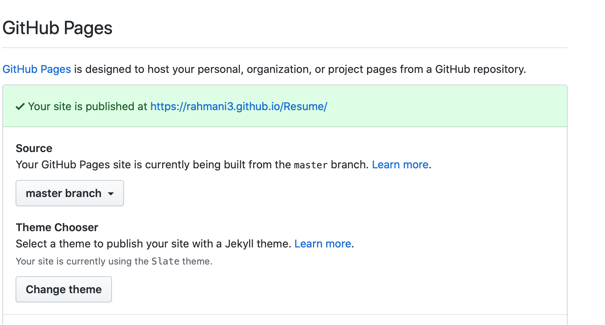

# How to host your Resume on GitHub Pages

This document is meant to give you an overall idea on how to host your own assignment of GitHub pages just like I have done. Prior to this, I had no experience in Markdown or GitHub, so this is for the people who are in a similar position.

---
## Getting Started

First off, you will need to get a [GitHub](www.github.com) account. All you need to do is sign up for it by using your email address. Then, you will need to make a username for yourself and it can be anything you want it to be, as long as it is not taken by someone else. Once you have signed up on GitHub you can download [GitHub desktop](https://desktop.github.com) on your computer and sign in there.

Now, before doing anything else on GitHub, we move on to making a resume. Your resume will need to be written using Markdown. And to write this resume, you will need an editor. The editor I used is [Atom](https://atom.io). The main reason I used Atom is because it is compatible with GitHub. Also, it has a pretty neat live preview feature which allows you to see how your code is coming along, which I have found to be very helpful.

Lastly, now that you have set up both GitHub desktop and Atom on your computer, all that is left for you to do is [learn Markdown](https://www.markdowntutorial.com). It will not take much time to learn. Now that you have covered all the prerequisites, you are ready to host your resume on GitHub.

---

## Creating a Repository

 Once you sign in on GitHub desktop, you will have the option of creating a repository. When you click that it will prompt you to enter a name for your repository. In my case, I have named it "Resume" for obvious reasons.

 ---

## Making your Resume and Posting it

|Step  |Actions|
|:-----:|:------------:|
|Step 1| Select "Open in Atom" on GitHub desktop |
|Step 2|Open index on atom and save it as index.md|
|Step 3| Make your Resume in the index.md file|
|Step 4|Save your index.md file|
|Step 5|Go back to GitHub desktop|
|Step 6|Write a comment on why you made the change|
|Step 7|Select "Commit to master"|
|Step 8|Select "Push Origin"|

 

---

## Editing your Resume with Jekyll

After you have uploaded your resume on your GitHub repository, you can either choose to leave it as it is and see the published version on GitHub pages or you can do what I did and choose one of the predefined Jekyll themes on GitHub and use it for your resume. To do this, all you have to do is:
* Go to "Settings" on your GitHub repository  
* Browse down to "GitHub Pages"
* Select "Change theme"
* Choose any of the predefined Jekyll as you like (I used slate)
* Refresh the page

 

---

## Hosting your Resume on GitHub pages

Lastly to view your resume on GitHub pages, you simply go to "Setting" and scroll down to "GitHub Pages" and click on the link that is given and there you have it, your resume, published on GitHub Pages.

This is basically how I hosted my resume on GitHub pages. There are other ways to do it.

---

## Other Resources

If you do not think Atom is an editor you are comfortable working with, there is also [Visual Studio Code](https://code.visualstudio.com/download) that you can try out.

Other than the Markdown tutorial provided above there are plenty of other sites you can choose to learn Markdown from. For example, this really helpful [Markdown Cheatsheet](https://github.com/adam-p/markdown-here/wiki/Markdown-Cheatsheet) on GitHub.

There are plenty of other resources available on the internet, you just have to [google it!](https://www.google.com)

---

## Authors and Acknowledgements

Author: **Ishmam Rahman** : [GitHub](https://github.com/rahmani3)

Slate theme Author: pages-themes

Peer Editing: Alex and Egor

---

## FAQs

**Can I use GitHub without downloading GitHub desktop?**  
Yes, you can use GitHub without downloading GitHub desktop, you can use terminal as a git client.

**I changed my theme, why can't I see it on GitHub pages?**  
When a change is made GitHub takes a bit of time to deploy it, you can try refreshing the page.
